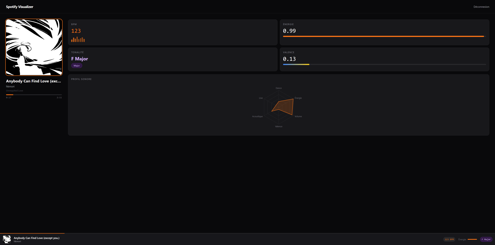

# Spotify Visualizer

**Demo live : [spotify-visualizer-vercel.vercel.app](https://spotify-visualizer-vercel.vercel.app/)**

Visualisation en temps réel des caractéristiques audio d'un morceau Spotify — BPM, énergie, tonalité, valence et plus.

## Aperçu



## Features

- Affichage en temps réel du morceau en cours de lecture
- Audio features simulées de façon déterministe par ID de morceau (voir [note technique](#note-technique--audio-features))
- Radar chart des 6 dimensions sonores
- Couleur d'accent dynamique selon l'énergie du morceau
- Mini player persistant en bas de l'écran
- Authentification OAuth 2.0 PKCE (sans backend)

## Stack

| Outil | Rôle |
|---|---|
| React 18 + Vite | UI + bundler |
| TypeScript strict | Typage complet, zéro `any` |
| React Router v6 | Navigation + route protégée |
| Tailwind CSS | Styles |
| Recharts | Radar chart |
| Zustand | State management global |
| Spotify Web API | Données player en temps réel |

## Note technique — Audio features

Le endpoint `/v1/audio-features` de l'API Spotify a été **déprécié le 27 novembre 2024** pour toutes les applications créées après cette date. Il est donc inaccessible pour ce projet.

Pour contourner cette limitation tout en conservant des visualisations cohérentes, les audio features (BPM, énergie, valence, etc.) sont **générées de façon déterministe à partir de l'ID Spotify du morceau** via un algorithme pseudo-aléatoire seedé ([`src/utils/fakeFeatures.ts`](src/utils/fakeFeatures.ts)) :

1. L'ID du morceau (ex: `3n3Ppam7vgaVa1iaRUIOKE`) est converti en un entier via une somme des codes ASCII de ses caractères
2. Cet entier sert de graine (`seed`) à une fonction `sin`-based déterministe
3. Chaque feature utilise un offset différent (`seed + N`) pour être indépendante des autres
4. Résultat : **le même morceau produit toujours les mêmes valeurs**, peu importe le nombre de polls

```
"3n3Ppam7..." → seed: 847 → BPM: 124, energy: 0.73, valence: 0.41 ...
"4uLU6hMCj..." → seed: 812 → BPM: 98,  energy: 0.31, valence: 0.88 ...
```

## Installation

```bash
git clone https://github.com/Chasmyr/spotify-visualizer
cd spotify-visualizer
npm install
```

Crée un fichier `.env` à la racine :

```
VITE_SPOTIFY_CLIENT_ID=ton_client_id
VITE_REDIRECT_URI=http://127.0.0.1:5173/callback
```

> Obtiens ton `Client ID` sur [developer.spotify.com](https://developer.spotify.com/dashboard) et ajoute `http://127.0.0.1:5173/callback` comme Redirect URI.

```bash
npm run dev
```

## Tester l'application

L'app tourne en **mode Development Spotify** — l'accès est limité à 25 utilisateurs ajoutés manuellement, ce qui est largement suffisant pour un portfolio.

**Demo live : [spotify-visualizer-vercel.vercel.app](https://spotify-visualizer-vercel.vercel.app/)**

**Pour obtenir l'accès :** envoie-moi ton email Spotify en DM, je t'ajoute immédiatement.

## Déploiement

[](https://vercel.com/new/clone?repository-url=https://github.com/Chasmyr/spotify-visualizer)

1. Déploie sur Vercel
2. Ajoute les variables d'environnement dans le dashboard Vercel
3. Ajoute l'URL de prod comme Redirect URI dans ton Spotify Dashboard

## Ce que j'ai appris

- Flow OAuth 2.0 PKCE sans backend (Proof Key for Code Exchange)
- TypeScript strict : types génériques, unions, type guards sur les réponses API
- Contournement d'une API dépréciée : génération déterministe de données via un PRNG seedé par l'ID
- Polling optimisé : progression mise à jour sans re-render complet grâce à Zustand
- Visualisation de données avec Recharts (radar chart responsive)
